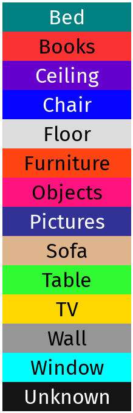

# README #

### Related publications ###
Please cite this work if you make use of our system in any of your own endeavors:

* **[SemanticFusion: Dense 3D Semantic Mapping with Convolutional Neural Networks](http://wp.doc.ic.ac.uk/bjm113/wp-content/uploads/sites/113/2017/07/SemanticFusion_ICRA17_CameraReady.pdf)**, *J. McCormac, A. Handa, A. J. Davison, and S. Leutenegger*, ICRA '17
* **[ElasticFusion: Real-Time Dense SLAM and Light Source Estimation](http://www.thomaswhelan.ie/Whelan16ijrr.pdf)**, *T. Whelan, R. F. Salas-Moreno, B. Glocker, A. J. Davison and S. Leutenegger*, IJRR '16

# 1. How to build it? #
The system has been developed for Linux. It has been tested on Arch Linux, with gcc-7 (gcc-5 for CUDA compilation), CUDA 8.0, OpenGL 4.5.0 (NVIDIA Driver 384.90), and CMake 3.8.2, with an Intel Core i7-5820K CPU @ 3.30GHz and Nvidia Geforce GTX 1080.  Unfortunately I do not have the capacity to debug system specific issues, but will try to help time-permitting.
Clone recursively with:

```
git clone --recursive https://username@bitbucket.org/jbmcc/semanticfusion_public 
```

Make sure you can have all the dependencies and can compile and run the two major software packages this framework uses: [elasticfusion](https://github.com/mp3guy/ElasticFusion) and [caffe](https://github.com/BVLC/caffe) (an old version with commit ```b23e9b1b2196a230d0```).  They have both been slightly modified for this repo, so to be sure they are working build both of the projects that are cloned within the this repo. The changes however are minor, so the compilation and dependency instructions provided for those projects still apply.

For ElasticFusion use the CMake build system, rather than the build.sh.  Only the ```Core``` ElasticFusion folder needs to compile, however by building the GUI and checking ElasticFusion runs live is useful for debugging issues down the line, as SemanticFusion uses a similar GUI.

For caffe it uses the OpenBLAS library (from the [AUR](https://aur.archlinux.org/packages/openblas-lapack/)) by default as specified in ```caffe/cmake/Dependencies.cmake``` line 84. Feel free to use another implementation - although note it has not been tested.  Make sure to build caffe with CMake, not make, i.e.

```
mkdir caffe_semanticfusion/build
cd caffe_semanticfusion/build
cmake ..
make
```

If both of the dependencies are working, make a build directory and compile - this should build both sub-projects and then SemanticFusion.

```
cd semanticfusion
mkdir build
cd build
cmake ..
make -j7
```

There are sometimes issues with finding OpenNI2.  A quick fix for this can be to edit the ```FindOpenNI2.cmake``` file in the root directory to point towards the location of your OpenNI2 directory. These paths should be added in two places. I.e.

```
...
28            "${CMAKE_SOURCE_DIR}/../../../code/OpenNI2/Include"
xx            /path/to/your/OpenNI2/Include
29            /usr/include
...
52               "${CMAKE_SOURCE_DIR}/../../../code/OpenNI2/Bin/x64-Release"
xx              /path/to/your/OpenNI2/Bin/x64-Release
53              /usr/lib
```

# 2. Download Models #

The CNN models are available [here](https://www.doc.ic.ac.uk/~bjm113/semantic_fusion_data/) with the _model.tar.gz suffix. Download and extract them to the caffe subfolder of this project ```caffe_semanticfusion/models/nyu_rgbd``` and ```caffe_semanticfusion/models/nyu_rgb```.  By default the ```nyu_rgbd``` CNN is used, but to edit this (for example to the RGB-only CNN, simply modify the CNN path in the ```src/main.cpp```, and recompile. I.e.

```
caffe.Init("../caffe_semanticfusion/models/nyu_rgb/inference.prototxt","../caffe_semanticfusion/models/nyu_rgb/inference.caffemodel");
```

# 3. How to run it? #

If you have a primesense camera and OpenNI2 working (i.e. you can run ElasticFusion live) then you can run SemanticFusion with the 13-NYU classes by simply running the program with no arguments in the build directory. You need to make sure OpenNI2 can detect and access the feed from the camera, and if you have multi-gpus ensure your desktop is running on the same GPU as SemanticFusion as an OpenGL context is required.

```
./SemanticFusion
```

A sequence of the NYU preprocessed dataset used for validation has been made available [here](https://www.doc.ic.ac.uk/~bjm113/semantic_fusion_data/) in ```nyu_data_small.tar.gz```. Each sequence is quite large, so only a single 200MB sequence has been made available. Download and extract this to any local directory e.g. ```/path/to/your/nyu_data_small```.

To run on this sequence provide two arguments to the SemanticFusion program to save the prediction pngs to the working directory (NOTE the second argument does not indicate where predictions are saved, it is a textfile denoting which predictions should be saved as they have a corresponding NYU ground truth annotation):

```
./SemanticFusion /path/to/your/nyu_data_small/bathroom_0003.txt /path/to/your/nyu_data_small/output_predictions.txt
```

The folder contains a textfile with frame paths in order, and a labelled frame textfile which specified which frames to output as labelled predictions.  These predictions are raw and so have 0 labels in areas without the reconstructed map.  To produce the final output predictions used for results, these zeros are overwritten by the baseline single-frame CNN network predictions.

The bathroom_0003.txt file looks like this:

```
1295406963667 /mnt/disk/datasets/nyu_processed/bathroom_0003/1_depth.png /mnt/disk/datasets/nyu_processed/bathroom_0003/1_rgb.png d-1295406963.666549-2770369813.pgm r-1295406963.67524    9-2771355972.ppm
1295406963699 /mnt/disk/datasets/nyu_processed/bathroom_0003/2_depth.png /mnt/disk/datasets/nyu_processed/bathroom_0003/2_rgb.png d-1295406963.698573-2772371968.pgm r-1295406963.70540    3-2773356259.ppm
1295406963730 /mnt/disk/datasets/nyu_processed/bathroom_0003/3_depth.png /mnt/disk/datasets/nyu_processed/bathroom_0003/3_rgb.png d-1295406963.729955-2774374123.pgm r-1295406963.73539    8-2775356547.ppm
```

And the output_predictions text file has the NYU depth and rgb frame id to test label number for validation.

```
kitchen_0004/d-1294851097.542259-2322437371.pgm              kitchen_0004/r-1294851097.528505-2321469380.ppm          1   
kitchen_0004/d-1294851106.887887-2881038616.pgm              kitchen_0004/r-1294851106.894265-2883550167.ppm          2   
office_0005/d-1294851456.202533-2366762831.pgm               office_0005/r-1294851456.187715-2365725825.ppm           9
```

# 4. License #
SemanticFusion is freely available for non-commercial use only.  Full terms and conditions which govern its use are detailed [here](http://www.imperial.ac.uk/dyson-robotics-lab/downloads/semantic-fusion/semantic-fusion-license/) and in the LICENSE.txt file.

# 5. Notes #

*** Performance vs. paper ***

This system has been re-based to the open-source version of ElasticFusion from an internal version.   As mentioned in its README:

*
A substantial amount of refactoring was carried out in order to open source this system, including rewriting a lot of functionality to avoid certain licenses and reduce dependencies. Although great care was taken during this process, it is possible that performance regressions were introduced and have not yet been discovered.
*

However, we re-validated the RGBD-SF on the NYU test set using this public implementation and the results where very similar (58.8% class average, 67.4% pixel avg.).

*** Colour scheme ***

The colour scheme used for semantic classes is given in the ```class_colour_scheme.data``` file.  As an easy lookup, the legend is uploaded in this project.


